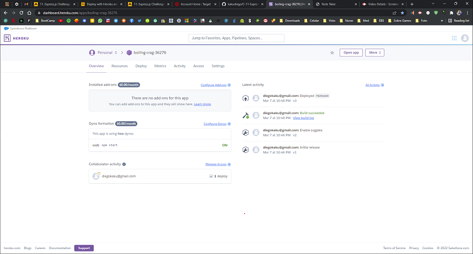
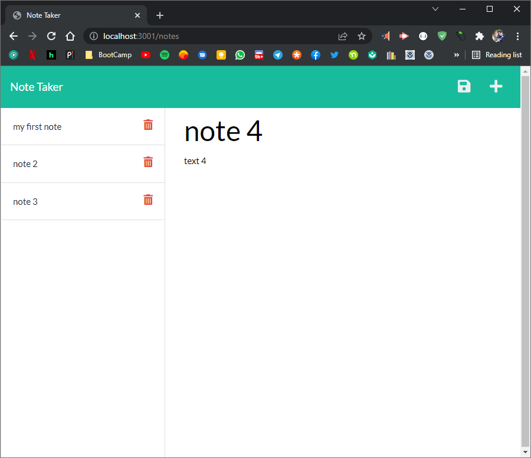
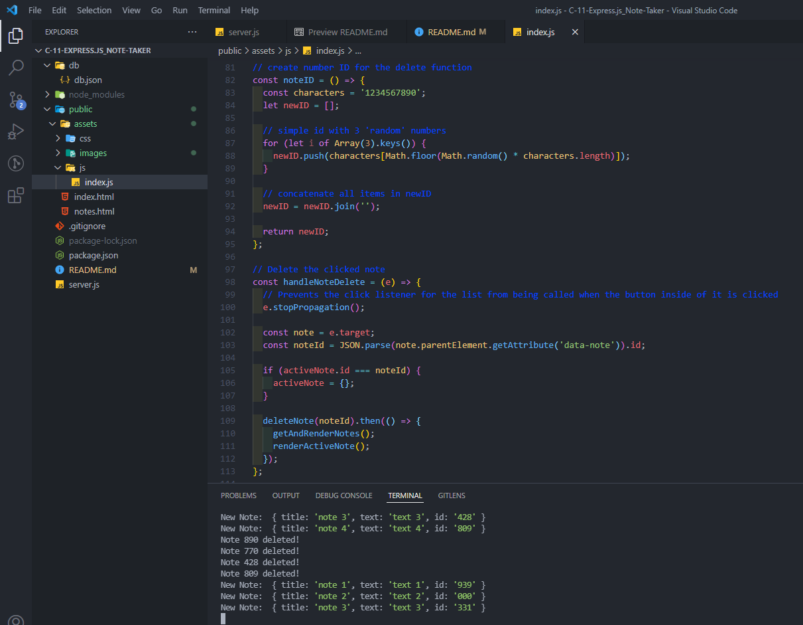

# C-11-Express_Note-Taker

## Description

    Note Taker that can be used to write and save notes. This application will use an Express.js back end and will save and retrieve note data from a JSON file.

## Table of Contents

- [Installation](#installation)
- [Usage](#usage)
- [License](#license)
- [Tests](#tests)
- [Contributors](#contributors)
- [Contact](#contact)

## Installation

clone/copy/download repo > npm install > open terminal > run the app

## Usage

write and save notes

## License:

This application is covered under the MIT license.

## Contributors

Contact below

## Tests

To test, run the following command: node index

## Contact

Project in GitHub: https://github.com/kakudiego/C-11-Express_Note-Taker

If you have any questions, contact me at diegokaku@gmail.com.

## Video demo

The following images/video demonstrates the application functionality.

https://user-images.githubusercontent.com/94471049/158073129-d0666076-4d57-41b6-82ae-441206f7fb74.mp4

#### Heroku:

#### Local

#### ID function

